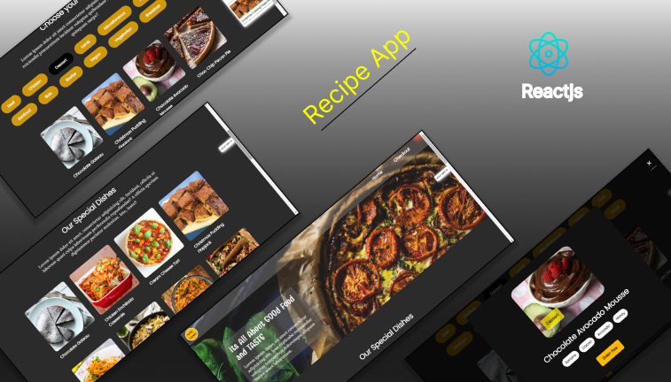

<h1 align="center">
  <br>
  <a href="http://www.amitmerchant.com/electron-markdownify"></a>
  <br>
  The Recipe App
  <br>
</h1>

<h4 align="center">A web app which provides you the various recipies of different dishes </h4>

<p align="center">
  <a href="#🚀-overview">Overview</a> •
  <a href="#🚀-built-with">Build with</a> •
  <a href="#🚀-dependencies-used">Dependencies</a> •
  <a href="#🚀-how-to-use">How to use</a> •
  <a href="#🚀-links">Live links</a>
</p>

<h5 align="center">Don't forget to give a ⭐️ </h5>

<hr>




## 🚀 Overview

- Gets the details of the recipies of different dishes.
- Search by category feature.
- User can make favorite to the dishes they like. 

<hr>

## 🚀 Built with

- [![Reactjs][reactjs]][reactjs-url] 
- [![TheMealDB API][TheMealDB API]][TheMealDB API-url]  
- [![sass][sass]][sass-url]

## 🚀 Dependencies Used

<h3>The following dependencies are used in this project:</h3>

<p>
 

</p>
<br>

<hr>

## 🚀 How To Use

To clone and run this application, you'll need [Git](https://git-scm.com) and [Node.js](https://nodejs.org/en/download/) (which comes with [npm](http://npmjs.com)) installed on your computer. From your command line:

```bash
# Clone this repository
$ git clone (    )

# Go into the repository
$ cd projects

# Install dependencies
$ npm install

# Run the app
$ npm start
```

> **Note**
> If you're using Linux Bash for Windows, [see this guide](https://www.howtogeek.com/261575/how-to-run-graphical-linux-desktop-applications-from-windows-10s-bash-shell/) or use `node` from the command prompt.


## 🚀 Links

- Solution URL: [GitHub](    )
- Live Site URL: [Food Diary](    )

<hr>


[reactjs]: https://img.shields.io/badge/REACT%20JS-000000?style=for-the-badge&logo=REACT&logoColor=61DBFB
[reactjs-url]: https://reactjs.org/

[sass]: https://img.shields.io/badge/sass-EE6983?style=for-the-badge&logo=sass&logoColor=fff
[sass-url]: https://sass-lang.com/

[TheMealDB API]: https://img.shields.io/badge/TheMealDB%20API-1C3879?style=for-the-badge&logo=&logoColor=21E1E1
[TheMealDB API-url]: https://www.themealdb.com/api.php


## 🚀 About Me
I'm a full stack developer...


## 🛠 Skills
Javascript, HTML, CSS...

## 📬 Contact


If you want to contact me, you can reach me through below handles.


[](https://www.linkedin.com/in/prasoon-mohan//)
[](https://twitter.com/mohan_prasoon)
[](https://twitter.com/mohan_prasoon)
